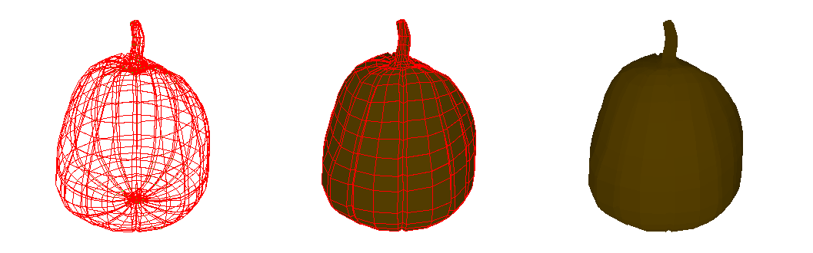

# Pillar

Just a small rendering engine made in Python using PIL.

Any `.obj` file can be rendered using `Obj.from_file()` (see `example.py`). Alternatively, class `Obj` can be used to create any shape, manually adjusting its vertices (see `create.py`).

`Obj`s can be translated, rotated, and scaled.

Class `Renderer` (through its method `render()`) will display any list of `Obj`s; camera position can be adjusted using using a `Tranformation` object.